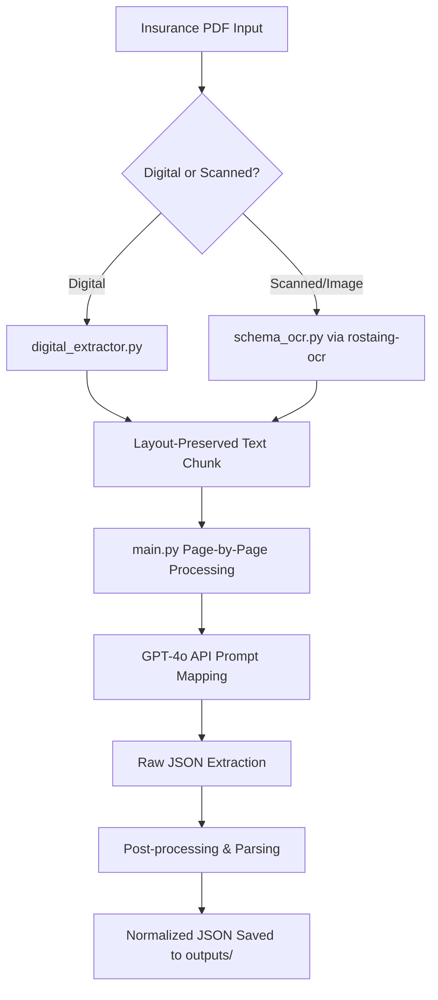

# Insurance PDF Parser & Schema Mapper

An intelligent, high-fidelity pipeline for parsing complex multi-page insurance plan comparison documents (PDFs) and mapping them to structured, normalized JSON schemas using GPT-4o.

The pipeline handles advanced PDF text extraction with layout retention, column-alignment correction for alternating "Current" and "Proposed" plans, automatic rotation detection, and CID garbage character checking. It also features a premium dark-themed FastAPI Web UI.

---

## 🌟 Key Features

* **Multi-Engine Text Extraction**:
  * **Digital Extraction** ([digital_extractor.py](file:///c:/Users/Intern/Resoucing%20edge/digital_extractor.py)): Extracts text using `pdfplumber` or `PyMuPDF` with automatic rotation correction and garbage token (`(cid:N)`) filtering.
  * **Layout-Preserving OCR** ([schema_ocr.py](file:///c:/Users/Intern/Resoucing%20edge/schema_ocr.py)): Integrates `rostaing-ocr` to preserve tables, spacing, and column headers, enabling precise parsing of scanned or image-based PDFs without expensive Vision LLMs.
* **Intelligent Column Alignment**:
  * Adapts dynamically to **4, 6, or 8-column layouts** representing pairs of alternating *Current* and *Proposed* plans.
  * Correctly maps headers (Carrier, Plan Name & Details, Network Type) to their respective benefit rows (Deductible, Coinsurance, OOP Max, Copays, RX, and Employee Rates).
* **Page-by-Page Processing Strategy**:
  * Splits PDFs page-by-page to prevent LLM context overflow and maintain extraction precision.
* **Premium Web UI & REST API** ([app.py](file:///c:/Users/Intern/Resoucing%20edge/app.py)):
  * Interactive dark-mode dashboard (using the Outfit font, ambient glow, and glassmorphic designs) featuring a drag-and-drop file uploader, real-time log streaming, and collapsible JSON rendering.
  * Single-endpoint API (`/upload`) for automated ingestion.
* **Caching & Cost Optimization**:
  * Automatically caches extracted text and LLM responses in the `outputs/` folder. Subsequent runs of the same PDF bypass expensive OCR and OpenAI API calls unless caches are deleted.

---

## 🏗️ Project Architecture



---

## 📂 File Structure

* [app.py](file:///c:/Users/Intern/Resoucing%20edge/app.py): The FastAPI application serving the Web UI and `/upload` endpoint.
* [main.py](file:///c:/Users/Intern/Resoucing%20edge/main.py): The core pipeline entry point, orchestrating text extraction, LLM mapping, and JSON formatting.
* [digital_extractor.py](file:///c:/Users/Intern/Resoucing%20edge/digital_extractor.py): Digital PDF text layer reader with rotation correction and character filtering.
* [schema_ocr.py](file:///c:/Users/Intern/Resoucing%20edge/schema_ocr.py): Layout-preserving OCR processor for scanned documents using `rostaing-ocr`.
* [schema_json.txt](file:///c:/Users/Intern/Resoucing%20edge/schema_json.txt): JSON schema definition for the initial LLM response.
* [updated_schema.txt](file:///c:/Users/Intern/Resoucing%20edge/updated_schema.txt): Reference schema for the post-processed/normalized output JSON structure.
* [requirements.txt](file:///c:/Users/Intern/Resoucing%20edge/requirements.txt): Python dependencies.

---

## 🛠️ Setup & Installation

### 1. Prerequisites

Ensure you have Python 3.10+ installed on your system.

### 2. Set Up a Virtual Environment (Recommended)

```powershell
# Create environment
python -m venv venv

# Activate on Windows (PowerShell)
.\venv\Scripts\Activate.ps1

# Activate on macOS/Linux
source venv/bin/activate
```

### 3. Install Dependencies

```bash
pip install -r requirements.txt
```

### 4. Configuration

Create a `.env` file in the root directory:

```env
OPENAI_API_KEY=your_openai_api_key_here
LLM_MODEL=gpt-4o
```

---

## 🚀 How to Run

### Command Line Interface (CLI)

You can run the pipeline directly from the command line using [main.py](file:///c:/Users/Intern/Resoucing%20edge/main.py):

```powershell
# 1. Scan the current folder for all PDFs (skips already processed ones)
python main.py

# 2. Process a single PDF
python main.py "path/to/document.pdf"

# 3. Process all PDFs inside a specific folder
python main.py "path/to/folder/"
```

#### CLI Outputs

For every processed file (e.g., `quote.pdf`), a corresponding output folder is generated:

```
outputs/quote/
├── quote.pdf             # Copy of the original input PDF
├── quote.extracted.txt   # Preserved layout text file
├── quote.raw.json        # Flat JSON directly from GPT-4o
└── quote.json            # Final post-processed and normalized JSON
```

### FastAPI Web UI & API Server

To launch the interactive web dashboard and backend API:

```powershell
uvicorn app:app --reload
```

Once started, open your browser and navigate to:

* **Dashboard**: [http://127.0.0.1:8000](http://127.0.0.1:8000)
* **Interactive API docs (Swagger UI)**: [http://127.0.0.1:8000/docs](http://127.0.0.1:8000/docs)

---

## 📊 Data Mapping & Schema

### Normalized Output Schema Format

The final JSON matches the format defined in [updated_schema.txt](file:///c:/Users/Intern/Resoucing%20edge/updated_schema.txt):

```json
{
  "plans": [
    {
      "planName": "Aetna EPO 0 Central FL Choice Plus",
      "description": "Current",
      "coveredEmployeesAndRates": {
        "employeeOnly": { "enrollment": 4, "rate": 647.41 },
        "employeeSpouse": { "enrollment": 2, "rate": 1567.91 },
        "employeeChildren": { "enrollment": 0, "rate": 1426.30 },
        "family": { "enrollment": 0, "rate": 2276.10 }
      },
      "benefits": {
        "inNetwork": {
          "deductible(Individual/Family)": "$1,000 / $2,000",
          "coinsurance": "20%",
          "outOfPocketMax(Individual/Family)": "$5,000 / $10,000",
          "primaryCare": "$25 (DW)",
          "specialist": "$75 (DW)",
          "emergencyRoom": "$300 / 20% (AD)",
          "urgentCare": "$75 (DW)",
          "complexMedicalImaging": "20% (AD)",
          "prescriptionDrugs": "0 / $10 / $45 / $75",
          "specialtyPharmacyBenefitPerScript": "20%/40% ($250/$500 MAX) DW"
        }
      }
    }
  ]
}
```

> [!NOTE]
> Rates and enrollments are parsed and cast to standard data types (`integer` for enrollment count, `number` for premium rates) during post-processing. Missing fields are automatically padded with `"N/A"` or `0.0`.
